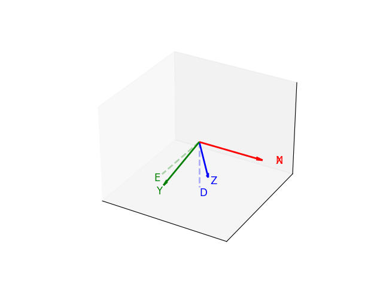
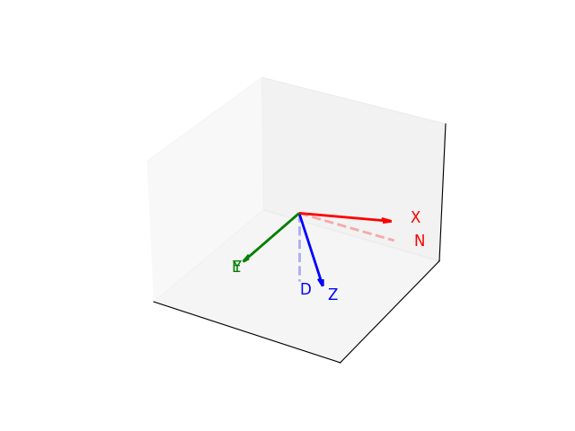
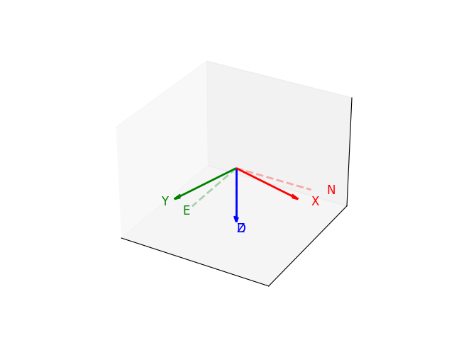
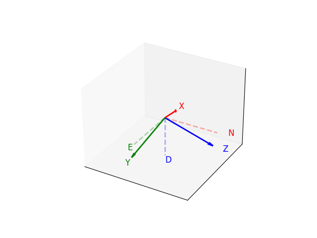

# attitude-representation
A tutorial of different attitude representations. I got confused so many times with this.

This will contain codes and minimal explanations for demonstration.

## Notes
Conventions, notations, all mathematical details I am referring to can be found [here](https://www.notion.so/jinrae/Dynamics-e-g-Rotation-matrix-1e3db4b4208580618a08dcd6add3a9d2?pvs=4).
- The above link may be private. In that case, please ask me for access.
- The content in the link will be subject to change.

## Summary of notations
### Frames
- $P$: Plot frame (the frame to plot a figure)
    - Assumed to be `FLU` (forward-left-up) in this example.
- $I$: Global frame (inertial frame); typically representing a local `NED` frame (north-east-down).
    - To visualize this, you have to convert basis vectors in $I$ to $P$.
- $B$: Local frame (body-fixed frame); axes are referred to as `XYZ` here.
    - To visualize this, you have to convert basis vectors in $B$ to $P$.

### Representations
- Euler angles: $\phi$, $\theta$, $\psi$ (roll, pitch, yaw)
    - Convention: ZYX rotation (from $I$ to $B$ frame)
- Rotation matrix: $R$
    - Convention: $R = R_{BI}$ (from $B$ to $I$ frame)
- (Unit) quaternion: $q$
    - Convention: $q = [q_w, q_v^T]^T = [q_w, q_x, q_y, q_z]^T$ (scalar first), corresponding to $R$

## Demonstrations
### Visualization
- See `./src/visualization.py` for the code. This uses rotation matrix to visualize the rotation of frames.

### Euler angles
- See `./src/euler_angles.py` for the code.
#### Rotation (roll 15 deg)

#### Rotation (pitch 15 deg)

#### Rotation (yaw 15 deg)

#### Rotation (mixed; yaw 45 deg, pitch 45 deg, roll 45 deg)

